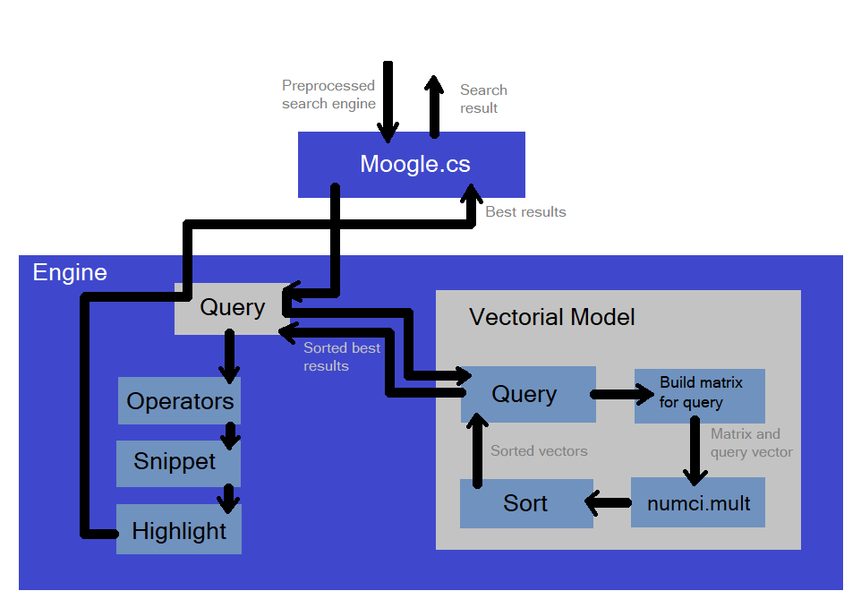
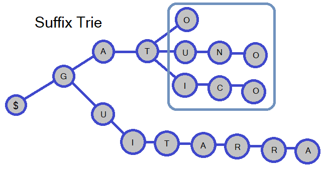

# Moogle Search Engine


---

# Architecture 
To run the proyect is recomended to use ```dotnet watch run --project MoogleServer```. Once the program is running, it will start preprocessing the files. When a query is made, the project will call the ```engine query``` function in the ```Moogle.cs``  file.
    
  

This method will call the ```query``` function on the ```engine's internal vector model```, which will first build the array of vectors of the files (only using the query words), then multiply this array of vectors by the query vector, and then with the created scalars, the files will be sorted by their respective scallar.  
After this, with the sorted files, the operators will be applied, which may change the ordering. Then we find the snippet of the best texts and the words of the queries will be highlighted, then we return the search result.
>The algorithmic part will be expalined now.


# Search Engine:
The search engine uses vectorial models to find the text that most closely resembles the query. First we vectorize the text and the queries using `TF-IDF` :
  
$tfidf=(\frac{f}{Tf})* log_{2}(\frac{Nt}{Df})$  

Where $f$ is the term frequency in the current text, $Tf$ is the term frecuency over all texts, $Nt$ is the number of texts and $Df$ is the number od texts in which the term appears.

After that for every query we can pass through all the text's vectors and see how close they are. To see that we can find the angle between the vector by the formula:

$\alpha=arcos{\frac{{a}\cdot{b}}{{|a|}\cdot{|b|}}}$ 

I decided to only use te `dot product` of the vector because is more easy to calculate and is similar to the cosine similarity.

  

# Word Similarity
## Looking for the most similar word:
Mistakes happen, sometimes we write words wrong or we put capital letters where they don't belong, that's why it is necessary to distinguish that these words are the same.  
To do that i used the `Edit Distance` algorithm. It gives you the number of operations that you have to do to one of the strings to convert it to the other. I realized that sometimes this is not the most optimal aproach, for example word `distra` is closer tto `citra` than `distra` to `dijkstra`, and i think that it shouldnt be like that, so i created my own distance formula:    

$d=\frac{editdistance}{lcp}$     

Where $lcp$ is the longes common prefix. Based on the intuition that mistakes in the first letters are worst that in the last ones.


## Looking for the words that are family:
In most languages, words are made up of a lexeme and a morpheme. Words that have the same lexeme usually belong to the same grammatical family, and tend to have similar meanings, so they are also important for the search.
For example in spanish, if we have the word `gatico`, we can say that the words `gato` and `gatuno`  are important too to the search, so we have to add them to the query.  
One approach to this is to have a database with all the families of words, lexemes, or morphemes, but this didn't seem like an elegant solution to me.
I decided to use a Trie Data Structure to find the words that belongs to the same family.  
  

  
  
For example, assuming that we want the words that are family of `gatico`, we look for all the words that end in some node that belongs to the subtree of the prefix `gat` (we remove the last $eps$ letters from the word, in this case $eps=4$) .


## Looking for synonyms:
The obvious approach is to have a database of all the synonyms, and for each word look up what its synonyms are.  
I found an [API](http://sesat.fdi.ucm.es:8080/Web/sinonimos.html) that provides synonyms of words so I decided to use it instead of a database, because a data base can be too large or incomplete.


> ⚠️ When the computer does not have internet it can take a little longer than normal because it tries to communicate with the API

---
# Operators

I decided to use 4 operators:
- `in`: only shows texts in which the word appears.
- `notin`: does not show the texts in which the word appears.
- `imp` : Increase the importance of the word
- `near` : Increases the importance of the document if the words appear close to each other.

So to calculate how important a text is we use the formula:

$ importance = dot*in*notin*imp*near $

Where $dot$ is the original dot product with the query.
It is then easy to notice that if the word appears in the text `in` it will take the value of 1 and `notin` will be 0.  
In te case of `near` it will be proportional to the minimum distance between the two elements.


---
# GUI:  
I tried to create a minimally pretty graphical user interface and I also added the functionality that when you click on a file name it opens a new tab with the full file.

---
# Computational complexity analysis:
## Search:
The search has a complexity of $O(Q*T)$ where $Q$ is the number of words and $T$ is the number of texts.
## Finding the most similar word:
The edit distance has a complexity of $O(N^2)$ where $N$ is the number of letters. And LCP has a complexity of $O(N)$. 
## Finding the words that are family:
Finding a word in the trie is $O(S)$ where $S$ is the size of the string, and searching the words that are family is $O(S*W)$ where $W$ is the numer of words that are family.

---
# Further Optimizations:
## K-Dimentional Tree
A nice optimization I came up with was to use a ```k-dimensional tree```. This is a data structure that allows us to solve the k-nearest neighbors problem, in a time complexity of $ O(M*logN) $ where $M$ is the number of words and $N$ is the number of texts, this has its advantages and disadvantages. As can be seen when the number of words in the text corpus is less than the number of texts, it is much faster than the other approach. But in practice, in small datasets it is very difficult for the number of words to exceed the number of texts, so for few texts, the other solution is better (that's why I decided to use that one), but for a large amount of texts the k-dimentional tree is better. I started to code the k-dimentional tree to diferenciate the two cases, but i didn't finish it (part of it is still in the code).

## Words embedings
Another idea can be to search for similar words using previously created word embeddings, but in practice this can be a bit inefficient, since you would have to search again for the k-nearest neighbors for each word.
## GPU's go brrrr! 🔥
Another interesting optimization can be to run the dot product between the matrix and the vector in a GPU, as GPUs are specialized in performing operations in parallel, to multiply matrices, the time of this operation should theoretically be faster in the GPU.  
To test this I tried two ways to implement it, the first was to connect the vector model with a Python code and run the matrix multiplication in Tensorflow with GPU, I managed to program this but when I tested it I realized that it was much slower than the initial approach ( probably because of the communication between Python and C#).   
Then I tried to use OpenCL, to calculate the dot product in the GPU, i downloaded a lot of OpenCl wrapers for C#, but none of those worked for me, but theoretically according to my research, it was possible to reduce the computation time with OpenCL.
